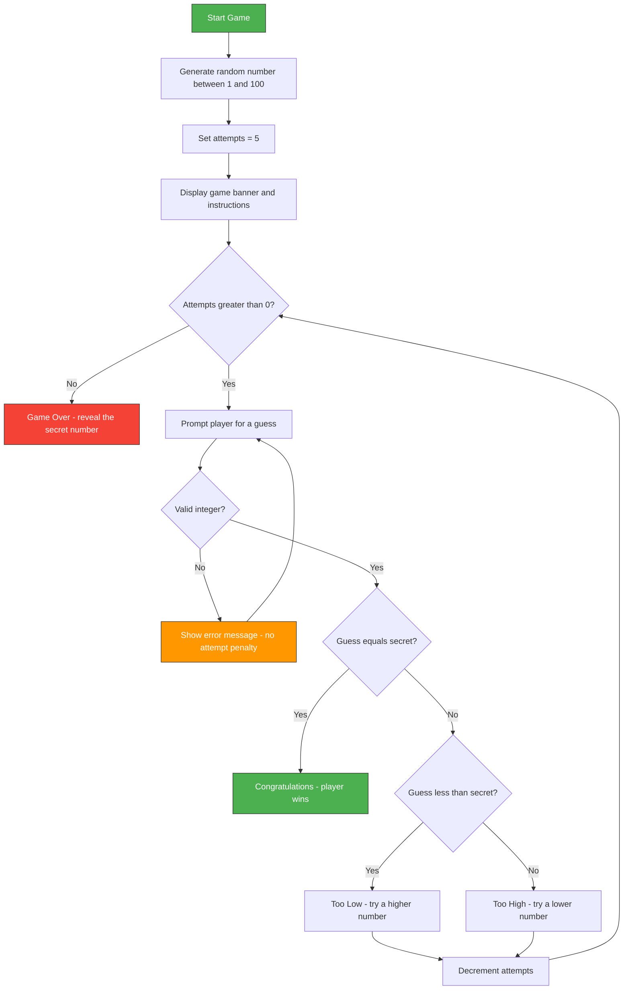

<div align="center">

<br/>

<!-- Animated Typing Banner -->


<br/>

<p align="center">
  
  
  
  
  
  
</p>

<br/>

> **A fun, interactive command-line Number Guessing Game built with Python.**
> The computer picks a secret number and you have 5 chances to guess it — with hints after every attempt!

<br/>

---

</div>

## 📋 Table of Contents

- [✨ Overview](#-overview)
- [⚙️ Features](#️-features)
- [📁 Project Structure](#-project-structure)
- [🔄 How It Works](#-how-it-works)
- [🔧 Function Reference](#-function-reference)
- [🚀 Getting Started](#-getting-started)
- [▶️ Usage](#️-usage)
- [🧪 Running Tests](#-running-tests)
- [📊 Sample Output](#-sample-output)
- [🛡️ Error Handling](#️-error-handling)
- [🧠 What I Learned](#-what-i-learned)
- [📜 License](#-license)
- [👤 Author](#-author)

---

## ✨ Overview

The **Number Guessing Game** is a fun, interactive Python project where the computer randomly selects a **secret number between 1 and 100**, and the player must try to guess it within a limited number of attempts. After every guess, the game provides intelligent **directional hints** — telling the player whether their guess was *too high* or *too low* — creating an engaging experience that combines logic, strategy, and a bit of luck.

This project is part of **Level 1, Task 2** of the **CodVeda Technologies Python Internship**, designed to strengthen core Python skills through hands-on, interactive programming challenges.

---

## ⚙️ Features

| Feature | Description |
|---|---|
| 🎲 **Random Number Generation** | A fresh secret number between 1–100 is generated every game using `random.randint()` |
| 🔢 **5 Attempt Limit** | Player gets exactly 5 chances, adding strategic pressure to each guess |
| 💡 **Directional Hints** | After each wrong guess, feedback of `Too High!` or `Too Low!` guides the player |
| 🛡️ **Input Validation** | Non-numeric inputs are caught gracefully via `try/except` — no crashes, no wasted attempts |
| 📊 **Live Attempt Counter** | Remaining attempts are displayed before every guess prompt |
| 🏆 **Win Detection** | Congratulatory message with the secret number and attempts used on a correct guess |
| 💀 **Game Over Reveal** | If all attempts are exhausted, the secret number is revealed to the player |
| 🎨 **Formatted UI** | Clean, bordered ASCII art banner and structured output for a polished terminal experience |

---

## 📁 Project Structure

```
📦 Number_Guessing_Game/
├── 🎮 guessing_game.py        # Core game logic, main entry point
├── 🧪 test_guessing_game.py   # Test runner / alternate entry point
├── 🚫 .gitignore              # Excludes __pycache__/ from version control
└── 📖 README.md               # Project documentation (you are here!)
```

---

## 🔄 How It Works

Here's a visual flowchart of the complete game logic:



## 🔧 Function Reference

All game logic lives inside [`guessing_game.py`](./guessing_game.py):

<br/>

### `play_game()` 🎮

The main function that orchestrates the entire game flow:

```python
def play_game():
    # Generates the Target Number and configure the maximum attempts.
    number = random.randint(1, 100)
    no_of_attempts = 5
```

> **Purpose:** Generates a random secret number, manages the game loop, validates input, provides hints, and determines the win/loss outcome.

**Key Responsibilities:**

| Step | What It Does |
|---|---|
| 1️⃣ **Generate Secret** | `random.randint(1, 100)` picks the target number |
| 2️⃣ **Display Banner** | Renders the formatted game title and instructions |
| 3️⃣ **Game Loop** | `while no_of_attempts > 0:` keeps prompting until win or exhaustion |
| 4️⃣ **Validate Input** | `try/except ValueError` catches non-integer entries |
| 5️⃣ **Compare & Hint** | Checks guess against secret; prints directional feedback |
| 6️⃣ **Determine Outcome** | Congratulates on win or reveals number on loss |

---

## 🚀 Getting Started

### Prerequisites

Make sure you have **Python 3.x** installed on your system.

```bash
# Check your Python version
python --version
```

> 💡 **No external libraries required!** This project uses only Python's built-in `random` module.

### Clone the Repository

```bash
git clone https://github.com/HarsheyGolar/codveda-python-internship.git
cd codveda-python-internship/Level-1/Number_Guessing_Game
```

---

## ▶️ Usage

### Run the Game Directly

```bash
python guessing_game.py
```

### Import as a Module

You can also import and call the game function from another script:

```python
from guessing_game import play_game

# Start the guessing game
play_game()
```

---

## 🧪 Running Tests

A dedicated test script [`test_guessing_game.py`](./test_guessing_game.py) is included as an alternate entry point:

```bash
python test_guessing_game.py
```

**What it does:**

```python
from guessing_game import play_game

if __name__ == "__main__":
    play_game()
```

> 🔍 This validates that the `play_game()` function is properly importable as a module and executes correctly when called externally.

---

## 📊 Sample Output

### 🏆 Winning Scenario

```
==================================================
             NUMBER GUESSING GAME
==================================================
------------------------------------------------------------
I am thinking... of a number between 1 and 100.
You have 5 attempts to guess it.
------------------------------------------------------------

[5 attempts left] Enter your guess: 50
Too Low! Try a higher number.

[4 attempts left] Enter your guess: 75
Too High! Try a lower number.

[3 attempts left] Enter your guess: 62
Too Low! Try a higher number.

[2 attempts left] Enter your guess: 68
Too Low! Try a higher number.

[1 attempts left] Enter your guess: 72
Congratulations! You Won By Guessing The Correct Number 72 in 1 attempts.
```

### 💀 Game Over Scenario

```
[1 attempts left] Enter your guess: 45
Too Low! Try a higher number.

Game Over! You have run out of attempts. The number was 63
```

### ⚠️ Invalid Input Handling

```
[5 attempts left] Enter your guess: hello
Please Enter the Valid Number.

[5 attempts left] Enter your guess: @#$
Please Enter the Valid Number.

[5 attempts left] Enter your guess:
```

> 💡 **Notice:** The attempt counter stays at **5** — invalid inputs are handled gracefully and **do not consume an attempt!**

---

## 🛡️ Error Handling

The game uses Python's `try...except` block to gracefully handle invalid user input:

```python
try:
    guess = int(input(f"\n[{no_of_attempts} attempts left] Enter your guess: "))
except ValueError:
    print("Please Enter the Valid Number.")
    continue    # ← Skips decrement, loops back to prompt
```

| Scenario | Behavior |
|---|---|
| User enters letters (`hello`, `abc`) | Shows error message, retries without penalty |
| User enters symbols (`@#$`, `!!!`) | Shows error message, retries without penalty |
| User enters nothing (empty input) | Shows error message, retries without penalty |
| User enters a valid number | Proceeds to comparison logic normally |

> 💡 The `continue` statement is key here — it **skips the attempt decrement** and jumps back to the top of the `while` loop, ensuring the player isn't penalized for typos or mistakes.

---

## 🧠 What I Learned

Through this project, I practiced and solidified the following Python concepts:

- ✅ **`random` module** — Using `random.randint()` to generate pseudorandom integers
- ✅ **`while` loops** — Creating game loops that run until a condition changes
- ✅ **`try` / `except` blocks** — Catching `ValueError` for robust input validation
- ✅ **`if` / `elif` / `else` chains** — Multi-branch conditional logic for game decisions
- ✅ **f-strings** — Dynamic string formatting for real-time feedback messages
- ✅ **`break` / `continue`** — Fine-grained loop flow control (exit on win, retry on bad input)
- ✅ **`__name__ == "__main__"` guard** — Making scripts safe for both direct execution and module import
- ✅ **Function encapsulation** — Wrapping all logic in `play_game()` for clean, reusable code
- ✅ **User experience design** — ASCII art banners, attempt counters, and clear feedback messages

---

## 📜 License

This project is licensed under the **MIT License** — see the [LICENSE](../../LICENSE) file for details.

```
MIT License — Copyright (c) 2026 Harshey Golar
```

---

## 👤 Author

<div align="center">

### **Harshey Golar**
*Python Intern @ CodVeda Technologies — Level 1*

<br/>

[](https://github.com/HarsheyGolar)

<br/>

---

<sub>⭐ If you found this project helpful, consider giving it a star!</sub>

<br/>

*Made with ❤️ and Python during the CodVeda Technologies Python Developer Internship*

</div>
