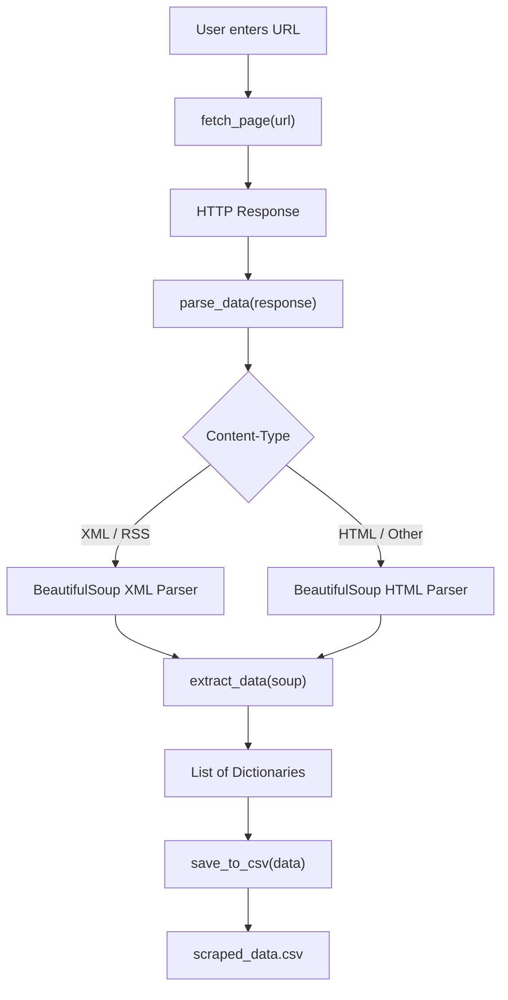

<div align="center">

# 🌐 Data Scraper

### A Modular Python Web Scraper for HTML, XML & RSS Data Extraction

<p>
  
  
  
  
  
  
  
</p>

<p>
  <strong>CodVeda Technologies · Python Development Internship · Level 2 · Task 2</strong>
</p>

</div>

---

## 📋 Table of Contents

- [Overview](#-overview)
- [Features](#-features)
- [Architecture](#-architecture)
- [Project Structure](#-project-structure)
- [How It Works](#-how-it-works)
- [Installation](#-installation)
- [Usage](#-usage)
- [CSV Output](#-csv-output)
- [Testing](#-testing)
- [Tested Sources](#-tested-sources)
- [Error Handling](#-error-handling)
- [Limitations](#-limitations)
- [Responsible Scraping](#-responsible-scraping)
- [Future Improvements](#-future-improvements)
- [Learning Outcomes](#-learning-outcomes)
- [Internship Context](#-internship-context)
- [Dependencies](#-dependencies)
- [License](#-license)
- [Author](#-author)

---

## ✨ Overview

**Data Scraper** is a modular Python application that accepts a public URL from the user, retrieves its content with `requests`, determines whether the response is HTML or XML/RSS, parses it with BeautifulSoup, extracts useful structured information, and exports the result to CSV.

The project was built to practice a real-world data-extraction workflow while keeping the implementation lightweight, readable, and easy to extend.

### Core Pipeline

```text
User URL
   │
   ▼
fetch_page()
   │
   ▼
HTTP Response
   │
   ▼
parse_data()
   │
   ├───────────────┐
   ▼               ▼
 HTML             XML / RSS
   │               │
   └───────┬───────┘
           ▼
      extract_data()
           │
           ▼
   Structured Records
           │
           ▼
      save_to_csv()
           │
           ▼
    scraped_data.csv
```

---

## ⚙️ Features

| Feature | Description |
|---|---|
| 🔗 **Runtime URL Input** | Accepts the target URL interactively instead of requiring a fixed URL in the source code |
| 🌐 **HTTP Fetching** | Retrieves remote content using `requests` |
| 🕵️ **Custom User-Agent** | Sends a browser-like User-Agent header |
| ⏱️ **Request Timeout** | Limits how long a request can wait |
| 🔍 **Format Detection** | Inspects the HTTP `Content-Type` header |
| 🧩 **HTML Parsing** | Uses BeautifulSoup's `html.parser` for standard webpages |
| 📰 **XML/RSS Parsing** | Uses BeautifulSoup's XML parser for XML/RSS responses |
| 📦 **Structured Data** | Produces a list of dictionaries for downstream processing |
| 📊 **CSV Export** | Saves extracted records into a CSV file |
| 🧪 **Automated Testing** | Includes a `unittest` suite covering fetching, parsing, extraction, and CSV output |
| 🧱 **Modular Design** | Separates fetching, parsing, extraction, and persistence responsibilities |

---

## 🏗️ Architecture



---

## 📁 Project Structure

```text
Data_Scraper/
│
├── data_scraper.py
│   ├── fetch_page()
│   ├── parse_data()
│   ├── extract_data()
│   └── save_to_csv()
│
├── main.py
│   └── Application entry point
│
├── test_data_scraper.py
│   └── Automated unit tests
│
├── requirements.txt
│   └── External dependencies
│
├── scraped_data.csv
│   └── Generated CSV output
│
└── README.md
    └── Project documentation
```

---

## 🔧 How It Works

### 1. `fetch_page(url)`

Responsible for retrieving the requested resource.

The function:

- receives a URL
- sends an HTTP `GET` request
- supplies a custom User-Agent
- applies a timeout
- returns the `requests.Response` object

This preserves access to useful response metadata such as status code, headers, and body text.

---

### 2. `parse_data(response)`

The parser checks the server-provided `Content-Type`.

```text
Content-Type
     │
     ├── XML / RSS → XML parser
     │
     └── Otherwise → HTML parser
```

This lets the same pipeline process standard HTML pages as well as XML/RSS responses.

---

### 3. `extract_data(soup)`

This function turns the parsed document into structured Python records.

#### XML / RSS

For RSS-style responses, the scraper looks for structured `<item>` records and extracts fields such as:

```text
title
source
pub_date
link
```

#### HTML

For ordinary webpages, the scraper extracts useful textual and link-based content from the parsed document.

The exact extracted fields depend on the target page's HTML structure.

---

### 4. `save_to_csv(data)`

The extracted records are written to a CSV file.

Current columns:

```text
title
source
pub_date
link
```

The writer safely handles missing fields by using empty strings where necessary.

---

## 🚀 Installation

### Prerequisites

Python 3.x is required.

Check your Python version:

```bash
python --version
```

### Clone the Repository

```bash
git clone https://github.com/HarsheyGolar/codveda-python-internship.git
cd codveda-python-internship/Level-2/Data_Scraper
```

### Create a Virtual Environment

Windows PowerShell:

```powershell
python -m venv .venv
.venv\Scripts\activate
```

### Install Dependencies

```powershell
pip install -r requirements.txt
```

---

## ▶️ Usage

Run the scraper:

```powershell
python main.py
```

The application asks for a URL:

```text
Enter Your Url:
```

Example:

```text
Enter Your Url:https://news.google.com/
```

The scraper then fetches the page, parses the content, extracts data, and writes the results to CSV.

Example console format:

```text
Total Items Extracted: 20

[1] Example Technology Article
   source: Example News
   Date:   Fri, 28 Aug 2026
   link:   https://example.com/article
```

The generated output is stored in:

```text
scraped_data.csv
```

---

## 📊 CSV Output

The exported CSV currently uses the following schema:

```csv
title,source,pub_date,link
```

Example:

```csv
title,source,pub_date,link
Example Technology Article,Example News,Fri 28 Aug 2026,https://example.com/article
Another Article,Tech Daily,Fri 28 Aug 2026,https://example.com/article-2
```

### Field Definitions

| Field | Purpose |
|---|---|
| `title` | Extracted page/article title or textual content |
| `source` | Source or publisher information when available |
| `pub_date` | Publication date when available |
| `link` | Extracted URL when available |

---

## 🧪 Testing

The project includes automated tests using Python's built-in `unittest` framework.

Run the complete suite:

```powershell
python -m unittest test_data_scraper.py -v
```

### Current Result

```text
Ran 6 tests

OK
```

### Test Coverage

| Test | Purpose |
|---|---|
| `test_fetch_page_success` | Verifies successful HTTP response handling |
| `test_parse_html` | Verifies HTML parsing |
| `test_parse_xml` | Verifies XML parsing |
| `test_extract_html_data` | Verifies HTML extraction |
| `test_extract_xml_data` | Verifies XML/RSS extraction |
| `test_save_to_csv` | Verifies CSV creation and written data |

The HTTP request test uses mocking so the test suite does not depend on a live external website.

---

## 🌍 Tested Sources

The scraper has been exercised against multiple public and practice pages, including:

- Google News Technology
- The Indian Express Technology section
- Books to Scrape
- Quotes to Scrape
- Web Scraper Test Sites
- web-scraping.dev

These tests cover different page structures and both HTML/XML-oriented responses.

---

## 🛡️ Error Handling

The application includes basic reliability measures such as:

- request timeout
- custom User-Agent
- HTTP response handling
- safe extraction when fields are missing
- empty-result handling
- automated unit tests

The extraction and CSV-writing layers use conditional access so missing fields do not unnecessarily break record generation.

---

## ⚠️ Limitations

This project uses a lightweight **HTTP + BeautifulSoup** architecture.

It is designed for publicly accessible pages whose relevant content is available in the server-delivered response.

It does **not** guarantee perfect extraction from every website.

Different websites can use different:

- HTML structures
- content layouts
- rendering strategies
- APIs
- authentication requirements
- anti-bot mechanisms

### JavaScript-Heavy Websites

Some sites render their primary content in the browser after JavaScript executes. That content may not exist in the initial response returned by `requests`.

Such cases may require browser automation tools such as:

```text
Playwright
Selenium
```

### Protected or Authenticated Pages

The scraper does not attempt to bypass:

- authentication
- CAPTCHAs
- access restrictions
- anti-bot protections

---

## 🔐 Responsible Scraping

Use this project responsibly.

- Respect the target website's Terms of Service.
- Review applicable `robots.txt` policies.
- Avoid excessive request rates.
- Do not bypass authentication or security controls.
- Do not attempt to circumvent CAPTCHAs or anti-bot systems.
- Only collect data you are permitted to access.

---

## 🔮 Future Improvements

Potential future enhancements include:

- [ ] Better semantic content detection
- [ ] Improved article and product recognition
- [ ] Duplicate detection
- [ ] Pagination support
- [ ] Retry and exponential backoff
- [ ] Structured logging
- [ ] JSON export
- [ ] Command-line arguments
- [ ] More comprehensive test coverage
- [ ] Optional Playwright support for dynamic webpages

These are future ideas and are not presented as currently implemented features.

---

## 🧠 Learning Outcomes

This project provided practical experience with:

- HTTP requests
- HTTP response headers
- HTML parsing
- XML/RSS parsing
- BeautifulSoup
- Python functions
- Lists and dictionaries
- File handling
- CSV generation
- Modular application design
- Mocking
- Unit testing
- Handling different webpage structures

---

## 🎓 Internship Context

This project was developed as part of the:

**CodVeda Technologies — Python Development Internship**

### Level 2 · Task 2 — Data Scraper

The task focuses on retrieving webpage content with `requests`, parsing HTML with BeautifulSoup, extracting useful data, and saving the result to CSV.

---

## 📦 Dependencies

External dependencies:

```text
requests
beautifulsoup4
lxml
```

Python standard-library modules such as `csv`, `unittest`, `unittest.mock`, and `tempfile` do not require separate installation.

---

## 📜 License

See the repository's `LICENSE` file for the applicable license.

---

## 👤 Author

<div align="center">

### Harshey Golar

**Python Developer · AI/ML Enthusiast**

[](https://github.com/HarsheyGolar)

</div>

---

<div align="center">

### ⭐ If you find this project useful, consider starring the repository.

**Built with Python during the CodVeda Technologies Python Development Internship.**

</div>
